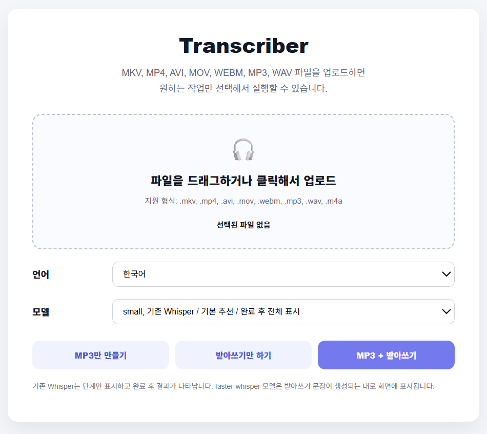
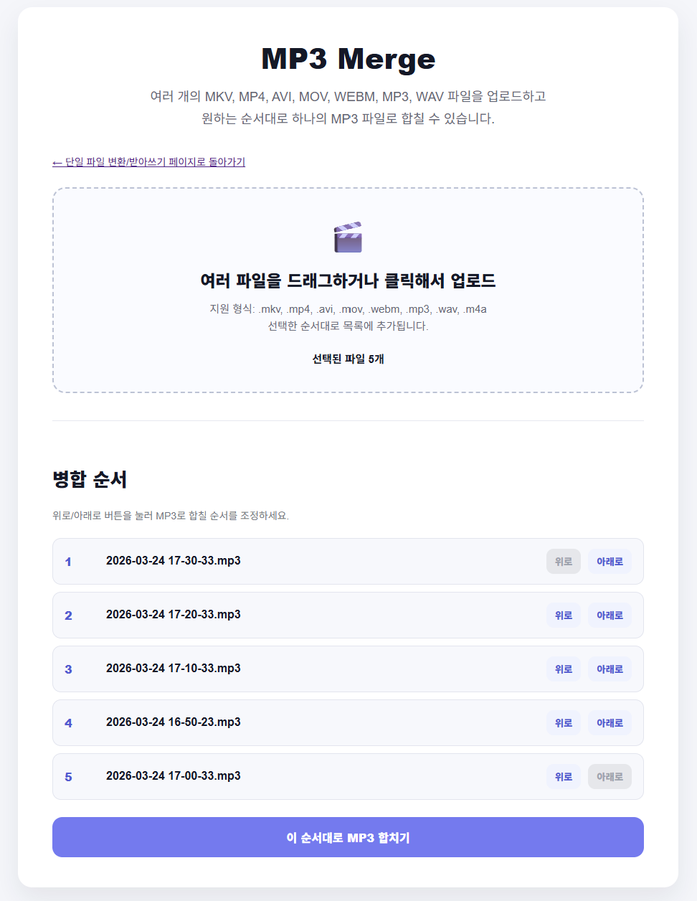
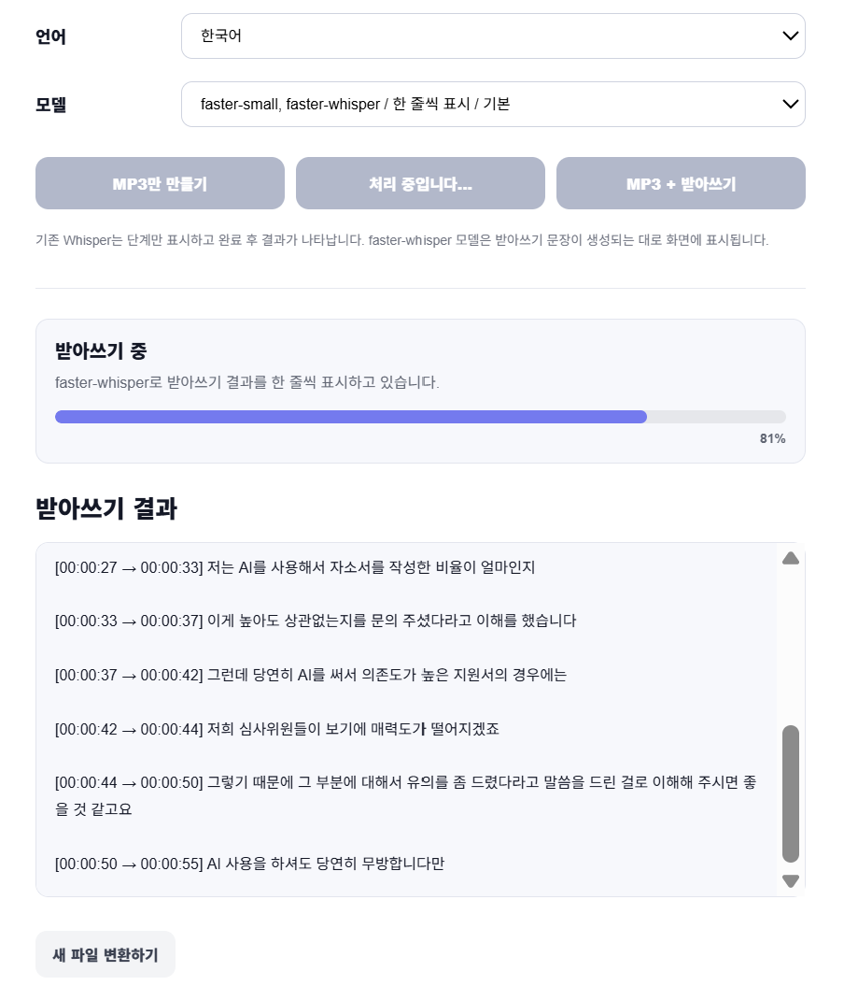
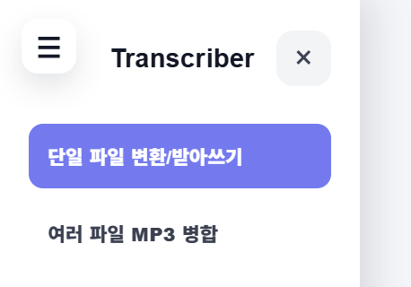

# Transcriber

영상과 음성 파일을 MP3로 변환하고, Whisper 기반 받아쓰기 결과를 TXT 파일로 생성하는 로컬 웹 애플리케이션입니다.  
단일 파일 변환뿐 아니라 여러 개의 영상 파일을 원하는 순서대로 합쳐 하나의 MP3 파일로 만드는 기능도 제공합니다.

---

## 주요 기능

### 1. 단일 파일 변환 / 받아쓰기

- MKV, MP4, AVI, MOV, WEBM, MP3, WAV, M4A 파일 업로드
- 영상 또는 음성 파일에서 MP3 추출
- Whisper 기반 받아쓰기 TXT 생성
- 시간 정보가 포함된 받아쓰기 결과 생성
- 기존 Whisper 모델과 faster-whisper 모델 선택 가능
- faster-whisper 선택 시 받아쓰기 결과를 구간별로 화면에 표시
- MP3만 만들기, 받아쓰기만 하기, MP3 + 받아쓰기 작업 분리

### 2. 여러 파일 MP3 병합

- 여러 개의 영상/음성 파일 업로드
- 업로드한 파일 순서 조정
- 각 파일에서 MP3 추출
- 지정한 순서대로 하나의 MP3 파일로 병합
- 병합 진행 상태 표시
- 병합된 MP3 다운로드 제공

### 3. 웹 UI

- FastAPI 기반 로컬 웹 서버
- 드래그 앤 드롭 파일 업로드
- 진행률 표시
- 결과 다운로드 링크 제공
- 사이드 네비게이션 메뉴 제공
- 단일 변환 페이지와 MP3 병합 페이지 분리

---

## 화면 예시

### 전체 화면 미리보기

| 단일 파일 변환 / 받아쓰기 | 여러 파일 MP3 병합 |
|---|---|
|  |  |

| 받아쓰기 진행 화면 | 페이지 이동 메뉴 |
|---|---|
|  |  |

```text
docs
└─ images
   ├─ transcriber-main.png
   ├─ transcription-progress.png
   ├─ merge-page.png
   └─ navigation-menu.png
```

---

## 기술 스택

- Python
- FastAPI
- Uvicorn
- Jinja2
- FFmpeg
- OpenAI Whisper
- faster-whisper
- HTML
- CSS
- JavaScript

---

## 프로젝트 구조

```text
transcriber
├─ input
│  └─ .gitkeep
├─ output
│  └─ .gitkeep
├─ temp
│  └─ .gitkeep
├─ src
│  ├─ __init__.py
│  ├─ config.py
│  ├─ main.py
│  ├─ web_app.py
│  ├─ services
│  │  ├─ __init__.py
│  │  ├─ audio_service.py
│  │  ├─ transcription_service.py
│  │  └─ merge_service.py
│  ├─ templates
│  │  ├─ index.html
│  │  └─ merge.html
│  └─ static
│     ├─ styles.css
│     ├─ app.js
│     └─ merge.js
├─ requirements.txt
├─ .gitignore
└─ README.md
```

---

## 설치 및 실행 방법

### 1. 저장소 클론

```bash
git clone https://github.com/sbyy77dev/transcriber.git
cd transcriber
```

### 2. 가상환경 생성

Windows PowerShell 기준입니다.

```powershell
python -m venv .venv
```

가상환경 활성화:

```powershell
.venv\Scripts\Activate.ps1
```

실행 정책 오류가 발생하면 아래 명령어를 먼저 실행합니다.

```powershell
Set-ExecutionPolicy -Scope Process -ExecutionPolicy RemoteSigned
.venv\Scripts\Activate.ps1
```

### 3. 패키지 설치

```powershell
pip install -r requirements.txt
```

### 4. FFmpeg 설치 확인

```powershell
ffmpeg -version
```

FFmpeg가 설치되어 있지 않다면 Windows에서는 다음 명령어로 설치할 수 있습니다.

```powershell
winget install Gyan.FFmpeg
```

설치 후 PowerShell 또는 VS Code 터미널을 다시 열고 확인합니다.

```powershell
ffmpeg -version
```

### 5. 웹 서버 실행

```powershell
uvicorn src.web_app:app --reload
```

브라우저에서 아래 주소로 접속합니다.

```text
http://127.0.0.1:8000
```

---

## 사용 방법

### 단일 파일 변환 / 받아쓰기

1. `http://127.0.0.1:8000` 접속
2. 영상 또는 음성 파일 업로드
3. 언어 선택
4. 모델 선택
5. 원하는 작업 선택

작업 버튼은 세 가지입니다.

```text
MP3만 만들기
받아쓰기만 하기
MP3 + 받아쓰기
```

### 모델 선택 기준

```text
base / small / medium
→ 기존 Whisper 사용
→ 단계만 표시하고 완료 후 전체 받아쓰기 결과 표시

faster-base / faster-small / faster-medium
→ faster-whisper 사용
→ 받아쓰기 구간이 생성되는 대로 화면에 표시
```

개발 및 빠른 테스트에는 `faster-base`를 추천합니다.  
정확도가 더 필요하면 `small`, `medium`, `faster-small` 등을 비교해서 사용할 수 있습니다.

### 여러 파일 MP3 병합

1. 왼쪽 상단 메뉴 버튼 클릭
2. `여러 파일 MP3 병합` 페이지 이동
3. 여러 영상/음성 파일 업로드
4. 파일 순서 조정
5. `이 순서대로 MP3 합치기` 클릭
6. 병합 완료 후 MP3 다운로드

---

## 파일 저장 방식

업로드 파일과 변환 결과는 로컬 폴더에 임시 저장됩니다.

```text
input
→ 업로드된 원본 파일

temp
→ 받아쓰기용 WAV, 병합용 중간 MP3, 병합 목록 파일

output
→ 사용자 다운로드용 MP3, TXT 결과 파일
```

`새 파일 변환하기` 또는 정리 링크를 통해 작업에 사용된 파일을 삭제할 수 있습니다.

---

## Git 관리

이 프로젝트는 실제 영상, 음성, 변환 결과 파일을 GitHub에 올리지 않습니다.

`.gitignore` 예시:

```gitignore
.venv/

__pycache__/
*.pyc

input/*
output/*
temp/*

!input/.gitkeep
!output/.gitkeep
!temp/.gitkeep

.env

.DS_Store
Thumbs.db
```

---

## 개발 기록 예시

이 프로젝트는 기능 단위로 커밋을 나누어 개발했습니다.

```text
feat: add audio extraction and mp3 export
feat: add whisper transcription service
feat: format transcript with timestamps
feat: add basic FastAPI web app
feat: improve web upload interface
feat: add separate conversion actions
feat: clean up generated files on reset
feat: add faster-whisper streaming transcription
feat: add multi-file mp3 merge page
feat: add toggleable navigation menu
```

---

## 향후 개선 아이디어

- 긴 영상 처리 시 작업 취소 기능 추가
- 병합 페이지에서 드래그 방식 순서 변경 지원
- 받아쓰기 결과를 SRT 자막 파일로 저장
- 화자 분리 기능 추가
- 변환 결과 자동 삭제 정책 추가
- React 기반 프론트엔드 분리
- 배포용 Dockerfile 추가

---

## 주의사항

이 앱은 현재 로컬 실행을 기준으로 만들어졌습니다.  
GitHub Pages는 정적 사이트 호스팅만 지원하기 때문에 FastAPI, FFmpeg, Whisper가 필요한 이 앱을 그대로 실행할 수 없습니다.

실제 웹 서비스로 배포하려면 Render, Railway, Fly.io, Hugging Face Spaces, Docker 기반 서버 등의 환경이 필요합니다.